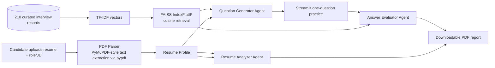

# PrepPilot — AI Interview & Resume Prep Agent

PrepPilot is a placement-focused AI/ML portfolio project that converts a candidate's PDF resume and target role into a grounded interview-preparation workflow. It combines PDF parsing, structured resume profiling, local vector retrieval, a LangGraph agent workflow, configurable LLM APIs, and a Streamlit practice interface.

> **Portfolio positioning:** This project extends a classical ML/CV portfolio into practical GenAI engineering: RAG, vector search, prompt design, agent orchestration, evaluation UX, reliability handling, and deployment readiness.

## What the app does

The user uploads a text-based PDF resume, enters a target role and optionally pastes a job description. PrepPilot parses the resume, identifies strengths and missing or under-evidenced skills, retrieves related interview patterns from a 210-record knowledge base, generates nine personalized interview questions, evaluates typed answers across clarity/correctness/structure, and produces a downloadable readiness report.

The knowledge base is split evenly across **70 AI/ML**, **70 Software/Backend**, and **70 Behavioral/HR** records. Each record contains an original question paraphrase, an original answer framework, a topic, difficulty, tags, and source attribution. The content is not a raw mirror of third-party pages. Public pages are used as preparation references, while the answer frameworks are authored for this project.

## Architecture



## Technical stack

| Layer | Implementation |
|---|---|
| UI | Streamlit |
| Agent orchestration | LangGraph state graphs |
| LLM providers | Groq OpenAI-compatible chat API by default; Gemini API fallback |
| Retrieval | TF-IDF normalized vectors with FAISS inner-product search |
| Resume parsing | pypdf with validation for empty, malformed, and image-only PDFs |
| Reporting | ReportLab PDF generation |
| Testing | pytest unit tests for parser, retrieval, and offline agent fallback |
| Deployment target | Streamlit Community Cloud |

## Run locally

Use Python 3.11 as requested by the portfolio brief. Create an environment, install dependencies, copy `.env.example` to `.env`, and add either a Groq or Gemini API key.

```bash
python -m venv .venv
# Windows PowerShell: .venv\\Scripts\\Activate.ps1
# macOS/Linux: source .venv/bin/activate
pip install -r requirements.txt
cp .env.example .env
streamlit run app/streamlit_app.py
```

The application can still be explored without a key in **Demo mode**, using deterministic fallback analysis, questions, and feedback. A real API key is required for live LLM responses.

## Rebuild the dataset and vector store

```bash
python scripts_generate_dataset.py
python scripts_build_index.py
```

The vector-store directory is ignored by Git because it is generated from the tracked JSON source. This keeps the repository reproducible and prevents large binary artifacts from becoming a maintenance burden.

## Test

```bash
pytest -q
```

The suite covers successful text extraction, malformed/empty input handling, retrieval relevance, and the no-key fallback path used for safe demos.

## Deployment notes

Create a public GitHub repository, then deploy the repository from [Streamlit Community Cloud](https://share.streamlit.io/). In the app's Streamlit secrets, add:

```toml
LLM_PROVIDER = "groq"
GROQ_API_KEY = "your-key"
GROQ_MODEL = "llama-3.3-70b-versatile"
```

For Gemini, use `LLM_PROVIDER = "gemini"`, `GEMINI_API_KEY`, and `GEMINI_MODEL`. Never commit `.env` or `secrets.toml`.

## Provider choice

The implementation keeps the provider configurable because free-tier availability and quotas can change. Groq's official quickstart documents the `llama-3.3-70b-versatile` chat-completion path and environment-variable key setup [1]. Google's official Gemini documentation describes a free developer tier and project-level RPM/TPM/RPD quota behavior [2] [3]. The app therefore includes retries, bounded output, and user-facing error messages rather than assuming unlimited access.

## Public source attribution

The AI/ML question themes are informed by the public [GeeksforGeeks Machine Learning Interview Questions](https://www.geeksforgeeks.org/machine-learning/machine-learning-interview-questions/) page [4]. Software/backend themes are informed by the public [GeeksforGeeks Backend Developer Interview Questions](https://www.geeksforgeeks.org/interview-prep/backend-developer-interview-questions-and-answers/) page [5]. Behavioral question structures and the STAR weighting are informed by MIT CAPD's [STAR method guide](https://capd.mit.edu/resources/the-star-method-for-behavioral-interviews/) [6]. The project's records include source URLs and a note that the questions are paraphrased and the answer frameworks are authored for this repository.

## Limitations and next improvements

The parser expects selectable text; scanned image-only resumes should be OCR-processed before upload. The default retriever is deliberately CPU-friendly and transparent; a future version could add a sentence-transformer embedding backend, hybrid lexical/vector retrieval, citation-level answer attribution, audio transcription, and an offline evaluation set for hallucination and retrieval-quality regression testing.

## Interview talking points

A concise way to explain the project is: “I built a resume-aware interview coach. The resume is parsed into a structured profile, relevant public interview patterns are retrieved from a local FAISS index, and LangGraph coordinates separate analysis, generation, and evaluation stages. I kept the LLM provider configurable, added retry/error handling, wrote tests for the deterministic core, and generated a downloadable report so the project demonstrates an end-to-end GenAI product rather than a single prompt.”

## References

[1]: https://console.groq.com/docs/quickstart "Groq Quickstart"
[2]: https://ai.google.dev/gemini-api/docs/pricing "Gemini Developer API pricing"
[3]: https://ai.google.dev/gemini-api/docs/rate-limits "Gemini API rate limits"
[4]: https://www.geeksforgeeks.org/machine-learning/machine-learning-interview-questions/ "Machine Learning Interview Questions and Answers"
[5]: https://www.geeksforgeeks.org/interview-prep/backend-developer-interview-questions-and-answers/ "Backend Developer Interview Questions"
[6]: https://capd.mit.edu/resources/the-star-method-for-behavioral-interviews/ "Using the STAR method for your next behavioral interview"
